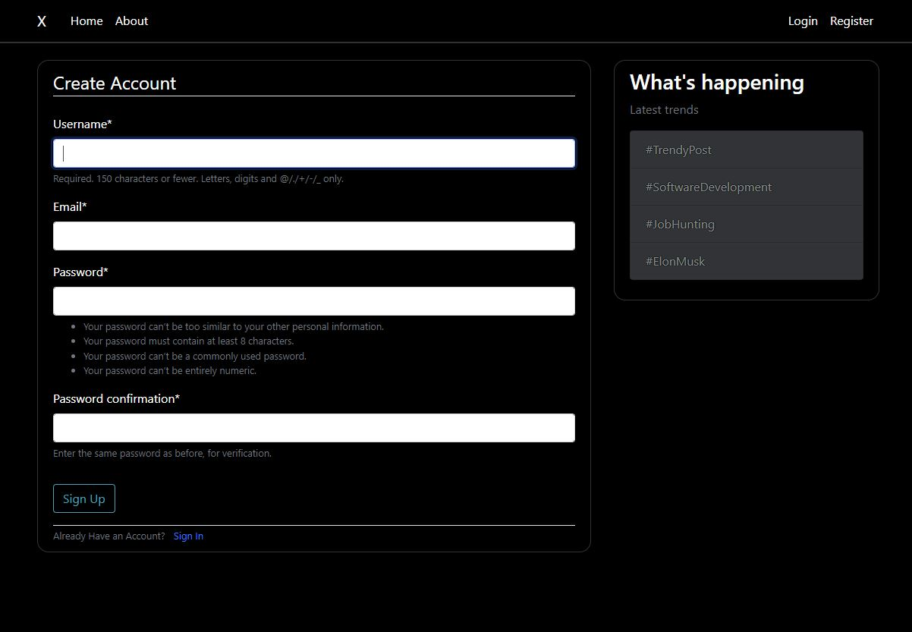
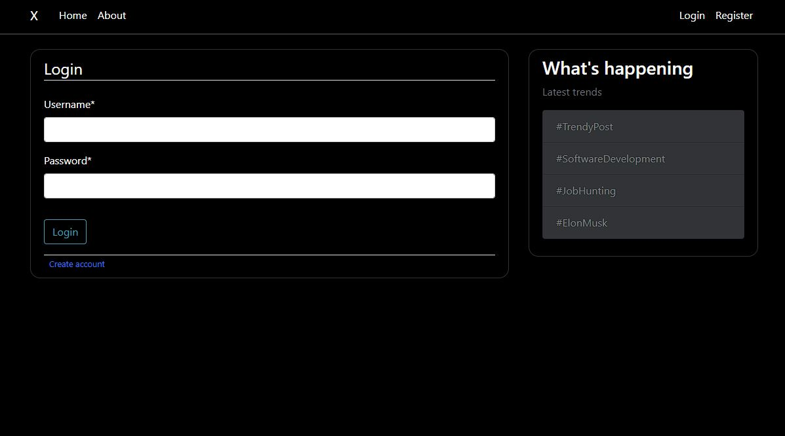
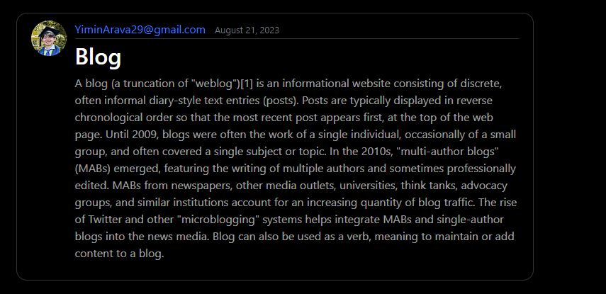

# Django Blog App

<details open="open">
  <summary>Table of Contents</summary>
  <ol>
    <li><a href="#about">About</a></li>
    <li><a href="#prerequisites">Prerequisites</a></li>
    <li><a href="#quickstart">Quickstart</a></li>
    <li><a href="#details">Details</a></li>
  </ol>
</details>

## About
A Blog site with functional user login created using Python Django. The Frontend is Bootstrap and Django Crispy forms, Backend is Django API and SQLite Database.

## Prerequisites
In order run and modify this app you need to following tools:
- [Python 3](https://mirror.las.iastate.edu/CRAN/)
- [Django](https://www.djangoproject.com/start/)
- [Django Crispy Forms](https://django-crispy-forms.readthedocs.io/en/latest/install.html)
- [SQLite](https://www.sqlite.org/doclist.html)
- [Bootstrap](https://getbootstrap.com/docs/4.0/getting-started/introduction/)
- [Github desktop version](https://desktop.github.com/)
- [An account on GitHub](https://github.com/)


## Quickstart
Clone the repository, then access the code on your IDE Make sure you are in the /Blog Directory, then in the terminal type the following to start running the Django app on your local machine:
```
python manage.py runserver
```

## Details

### Frontend
Frontend consists of HTML made with some bootstrap and django-crispy-forms. Created the base template then expanded it to fit the need of other pages.

### Backend
1. User login and registration is created with Django-contrib-auth, a builtin authentication system made by Django. 
2. I applied Crispy-Forms to make the UI look better.


3. Django uses default SQLite as its database. Users can make posts and you can see who made the posts on the main home page with the date and time next to it.


